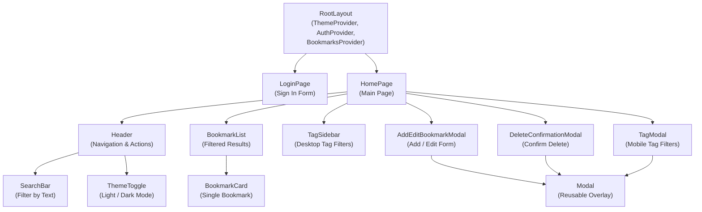
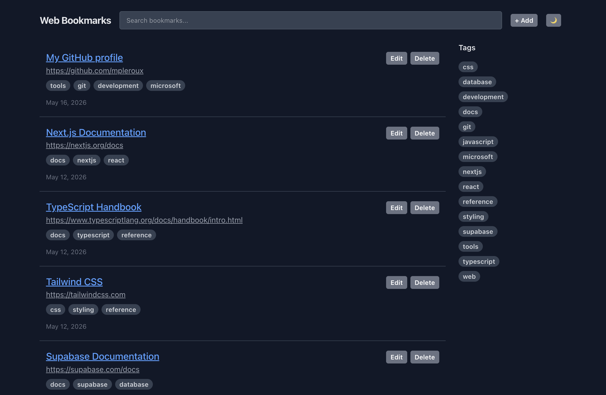

# README

A website bookmarking site modeled on Pinboard.in using React and Next.js. Work-in-progress.

## Features

- Save bookmarks with title, URL, and tags
- Organize with tag-based filtering
- Light/dark mode support
- Responsive design (desktop sidebar, mobile modal)
- Cloud-based persistence with Supabase

## Tech Stack

- React
- Next.js (App Router)
- TypeScript
- Tailwind CSS 4
- Supabase (PostgreSQL + Auth)

## Improvements

## Run locally

```sh
npm install
npm run dev # http://localhost:3000
```

## Architecture



## Screenshot


