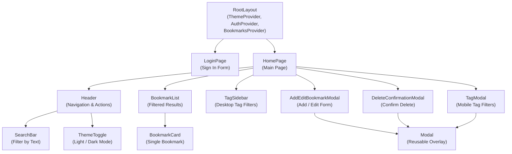
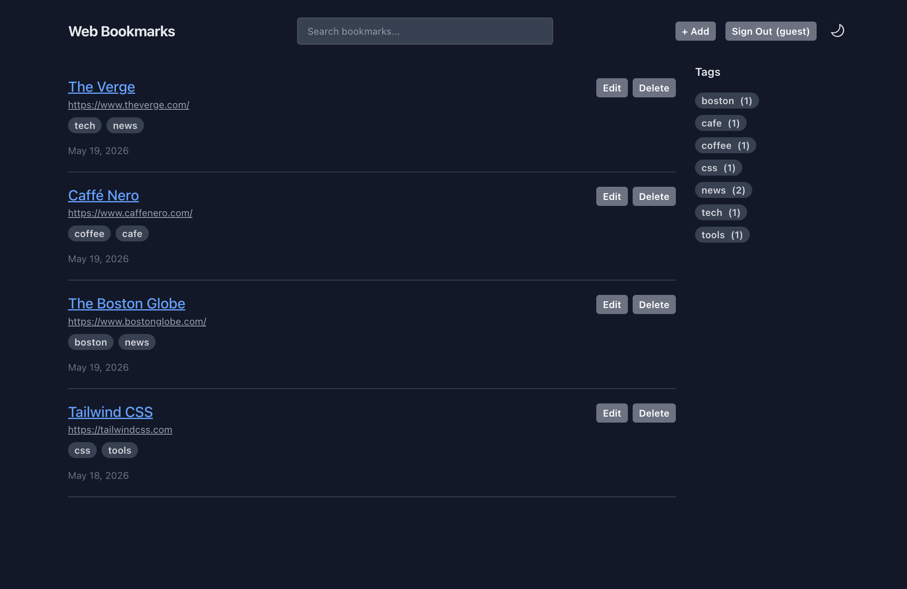
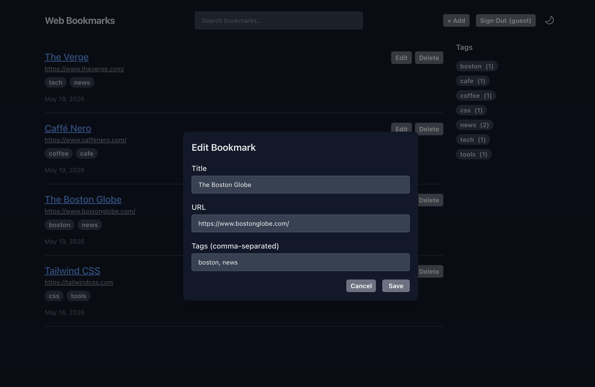

# Web Bookmarks

A website bookmarking site modeled on Pinboard.in using React and Next.js.

Live demo: [mleroux-web-bookmarks.netlify.app](https://mleroux-web-bookmarks.netlify.app/)

## Features

- Save bookmarks with title, URL, and tags
- Edit and delete bookmarks
- Tag-based filtering and full-text search
- Light/dark mode toggle
- Responsive design (desktop sidebar, mobile modal)
- Cloud persistence with Supabase PostgreSQL
- Authentication with Supabase Auth (email/password)
- Guest sign-in for demo purposes
- Public read access for visitors

## Tech Stack

- React
- Next.js (App Router)
- TypeScript
- Tailwind CSS 4
- Supabase
- @supabase/ssr
- Netlify

## Run locally

```sh
npm install
npm run dev # http://localhost:3000
```

## Architecture



## Environment Variables

Create a `.env.local` file in the project root with the following keys:

```sh
NEXT_PUBLIC_SUPABASE_URL=
NEXT_PUBLIC_SUPABASE_PUBLISHABLE_KEY=
NEXT_PUBLIC_GUEST_EMAIL=
NEXT_PUBLIC_GUEST_PASSWORD=
```

## Database

### bookmarks table

| Column | Type | Notes |
| ------ | ---- | ----- |
| id | uuid | Primary key, auto-generated |
| user_id | uuid | Foreign key to Supabase auth.users |
| title | text | Required |
| url | text | Required |
| tags | text[] | PostgreSQL array, defaults to {} |
| created_at | timestamptz | Auto-set on insert |
| updated_at | timestamptz | Updated manually on edit |

### Row Level Security policies

```sql
ALTER TABLE bookmarks ENABLE ROW LEVEL SECURITY;

CREATE POLICY "Anon read access"
ON bookmarks FOR SELECT TO anon
USING (user_id = 'your-owner-uuid');

CREATE POLICY "Authenticated users read own bookmarks"
ON bookmarks FOR SELECT TO authenticated
USING (auth.uid() = user_id);

CREATE POLICY "Authenticated users can insert"
ON bookmarks FOR INSERT TO authenticated
WITH CHECK (auth.uid() = user_id);

CREATE POLICY "Users can update own bookmarks"
ON bookmarks FOR UPDATE TO authenticated
USING (auth.uid() = user_id)
WITH CHECK (auth.uid() = user_id);

CREATE POLICY "Users can delete own bookmarks"
ON bookmarks FOR DELETE TO authenticated
USING (auth.uid() = user_id);

GRANT SELECT ON bookmarks TO anon;
GRANT SELECT, INSERT, UPDATE, DELETE ON bookmarks TO authenticated;
```

## Future enhancements

- Dark mode always defaults to light on page load. System preference detection was omitted to avoid a Next.js hydration error.
- Guest account bookmarks are not periodically reset. A malicious user could spam the database (be good).
- Background page scrolling is not prevented when the mobile tag modal is open
- Focus management in modals could be better
- No form validation for duplicate URLs or malformed tags
- Tag chip entry for Add/Edit modal instead of comma-separated text?
- Handle long lists of tags in tag modal, tag sidebar
- Add pagination
- Option to import and export bookmarks

## Screenshots



